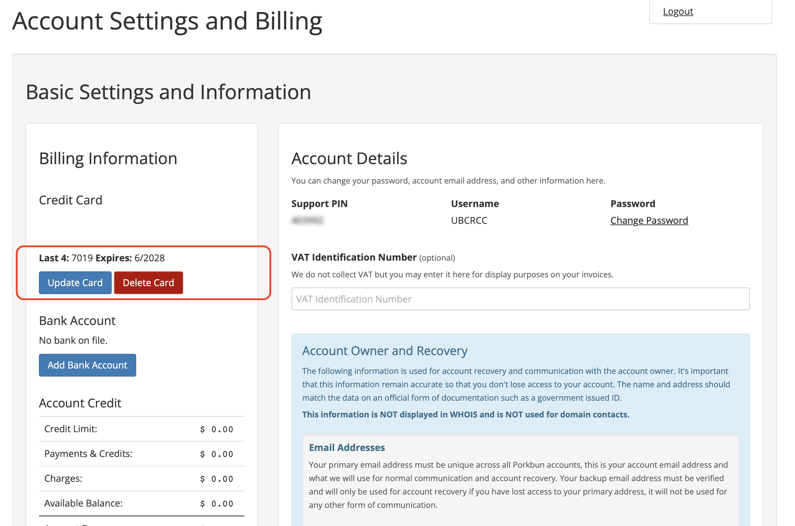
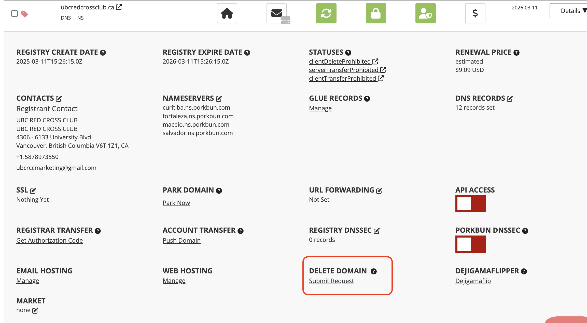
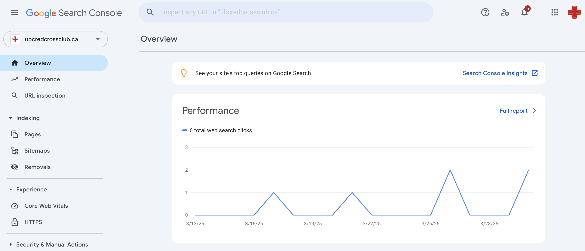

# 2 - Web Presence

This document covers use of Porkbun, the service from which we get our website's URL. Additionally, I'll introduce you to Google Search Console, where you can see stats about the website.

If you want to renew our URL, take the website off the internet, see how many people are looking at our website, or fix an issue with how it appears on the web, you're in the right place!

## Table of Contents

 1. [Porkbun](#porkbun)
 2. [Google Search Console](#google-search-console)

## Porkbun

### Signing In

1. Go to [Porkbun's website](https://porkbun.com/account/loginOnly).

2. Use username *ubcrccmarketing@gmail.com* and password *ubcrccWebs1te$* to sign in.

3. You will likely be asked for a verification code, sent to the Red Cross email. Use username *ubcrccmarketing@gmail.com* and password *UBCRCC202425!* to sign in to the email.

Sometimes this sign in can fail, I've found I run into fewer problems using Chrome over Safari.

### Updating Payment

Auto renewal is on for this domain, so you shouldn't have to explicitely pay. However, it's currently linked to my (Duncan's) credit card. To change the billing information, follow these steps:

1. In the top right, go to *Account -> Settings/Billing*.

2. Update or replace the card using the options on the left.

As a note, if you'd like to stop paying for the URL, which will 

### Removing the Website

If you want to remove the website from the internet so that it no longer is searchable, follow these steps:

1. Press the *Details* button to the right of the domain entry near the bottom right of the page.

2. Submit a request to delete the domain.

## Google Search Console

Google Search Console lets you see how the website is handled by Google. You can see things like how many people are visiting it, and how google sees your different pages.

To sign in, simply sign in to the marketing google account with username "ubcrccmarketing@gmail.com" and password "UBCRCC202425!" and go to [Google Search Console](https://search.google.com/u/1/search-console?resource_id=sc-domain%3Aubcredcrossclub.ca). 

There's nothing you should need to do here, but it's a good resource!