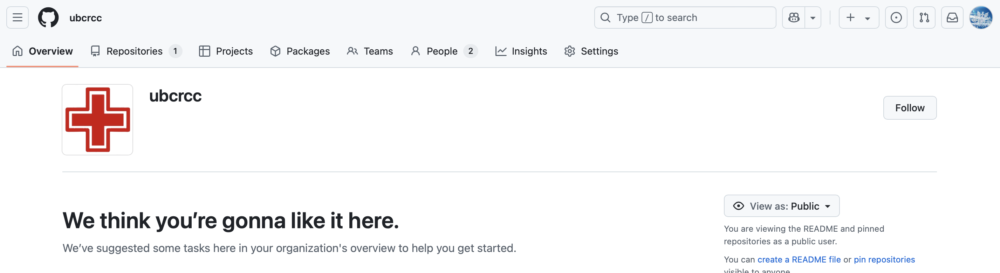
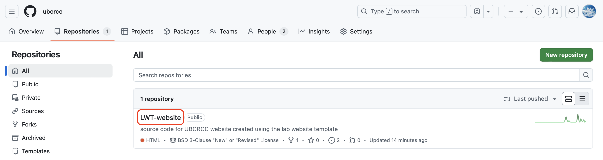
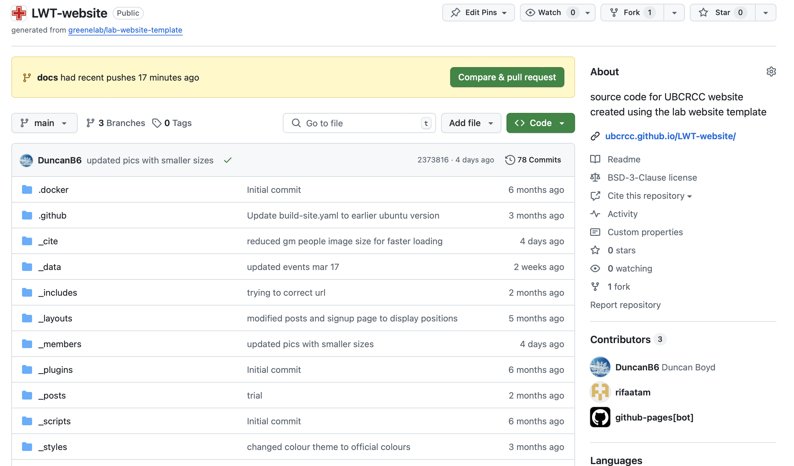
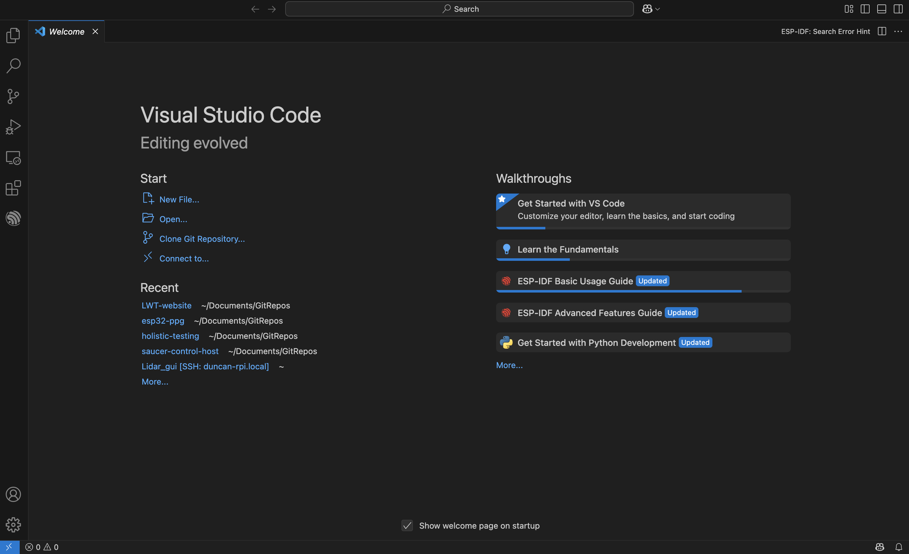
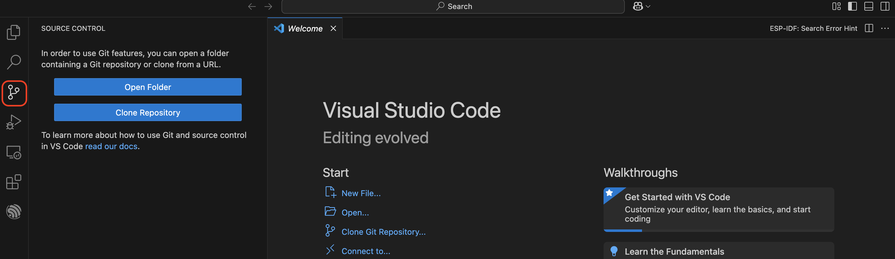

# 3 - Getting Software

In this document, you'll learn how to install all the software tools you need to maintain the website. This document will focus on setting up tools on MacOS, but all of these tools should be equally compatible with Windows (or Linux, but if you're using that you don't need my help).

## Table of Contents

 1. Github
 2. VS Code
 3. Git
 4. Docker

## Github

You'll need to be signed in and have access to our website's code to make changes. To set yourself up with Github, follow these steps:

1. Sign in to Github [here](https://github.com/login). If you don't have an account, make one. 

2. Please email me at *duncan@wapta.ca* and include your Github username and the email you used to create your account. I'll add you to our organization. In the future, you'll be able to add people too.

3. You should now be added to the UBCRCC Github organization. This sort of like a Google Drive folder.

\

4. Go to *Repositories* on the top bar, then click on *LWT-website*.

\

5. You should now be looking at our website's code!

\

## VS Code

Visual Studio code is an editor that makes it easy to change files, and integrates well with Git (more to come later). Install it using the following steps:

1. Get VS Code from [here](https://code.visualstudio.com/download).

2. Follow the installation steps.

3. Open VS Code.

\

## Git

Git is a version control system, meaning it allows you to go back to earlier versions of your work (among other things). You need it to interact with Github from your local computer files. To install it, go through the following steps:

1. Download Git from [here](https://git-scm.com/downloads).

2. Follow the installation steps.

3. If VS Code is open, close and reopen it.

Now, from VS Code, you should be able to click on the source control tab on the left, and see options to use Git.

\

## Docker

One tricky part of working on a website is that we don't always want to wait for the changes we make to go to the live website right away. It's nice to be able to preview your changes in a test environment. For that we'll use Docker, which among many other things, can build and show us the website as we make changes. Follow these steps to install:

1. Download Docker from [here](https://www.docker.com/get-started/).

2. Follow the installation steps.

3. Open Docker. You can minimize it if you'd like, it just needs to be running in the background while you're working on the website.

