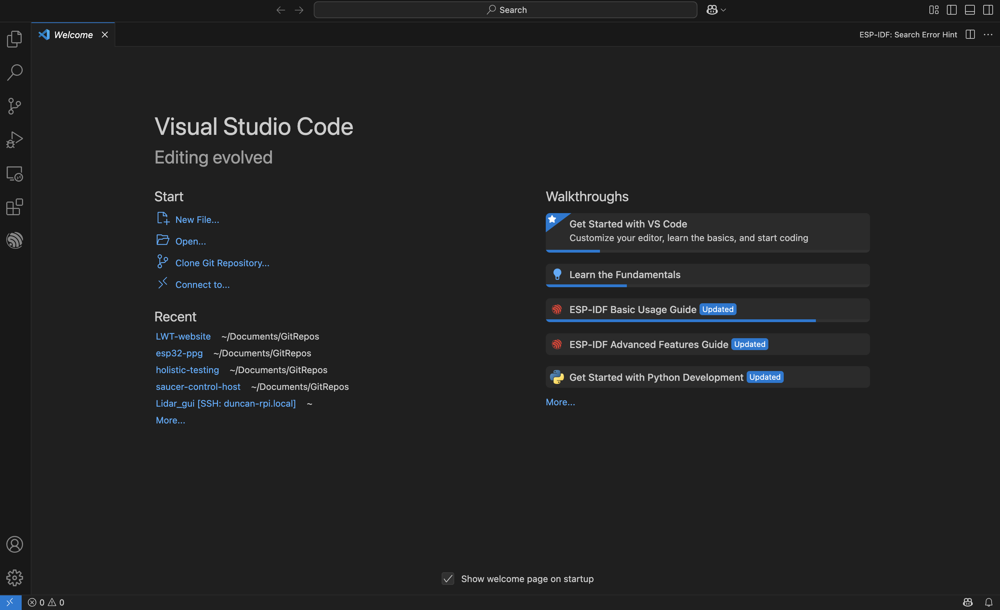

# 3 - Software Setup

In this document, you'll learn how to install and use the software tools you need to maintain the website. This document will focus on setting up tools on MacOS, but all of these tools should be equally compatible with Windows (or Linux, but if you're using that you don't need my help).

You'll need to go through all of the sections below to be able to make changes to the website.

## Github

To set yourself up with Github

1. First you'll need to sign in to Github to get access to our code. Sign in at "https://github.com/login". If you don't have an account, make one. 

2. Please email me at "duncan@wapta.ca" and include your Github username and the email you used to create your account. I'll add you to our organization. In the future, you'll be able to add people too.

3. You should now be added to the UBCRCC Github organization. This sort of like a Google Drive folder.

\

4. Go to "Repositories" on the top bar, then click on "LWT-website".

\

5. You should now be looking at our website's code!

\

## VS Code

Visual Studio code is an editor that makes it easy to change files, and integrates well with Git (more to come later). Install it using the following steps:

1. Get VS Code from "https://code.visualstudio.com/download".
2. Follow the installation steps to get it set up.

\

## Git

