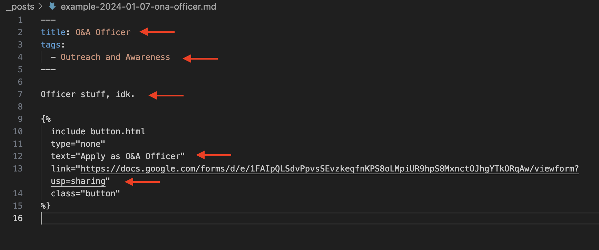

# 5 - Making Changes

Finally, you're set up and ready to do what you want with the website! This document will go into the website code and structure, and how to make the changes you want. 

## Table of Contents

 1. [Website Structure](#website-structure)
 2. [Landing Page](#landing-page)
 3. [Events](#events)
 4. [Sign Up](#sign-up)
 5. [People](#people)
 6. [About](#about)

## Website Structure

First let's go through the website structure quickly so you know what's up. There are five pages:

1. [Landing page](https://www.ubcredcrossclub.ca)\
This is the main page where users will end up after searching for the website. 

2. [Events page](https://www.ubcredcrossclub.ca/events/)\
This pages describes some upcoming and past events,

3. [Sign up page](https://www.ubcredcrossclub.ca/signup/)\
This page allows users to sign up as members, and offers links to job postings.

4. [People page](https://www.ubcredcrossclub.ca/people/)\
This page has profiles for our execs and directors.

5. [About page](https://www.ubcredcrossclub.ca/about/)\
This page describes all of our committees and our club.

## Landing Page

### Changing Text and Structure

The text for the landing page can be accessed in the top level folder, in the "index.md" file. You can change the descriptions on the main page here. You can also change the formatting and structure if you're so inclined.

### Changing Pictures

This page uses pictures in the "images/home" folder. If you'd like to change pictures, following these steps:

1. Find the picture you'd like to change in the "images/home" folder.

2. Find the link to that picture in the "index.md" file. You can do this by searching for the name of the picture.

3. Replace the picture in the "images/home" folder.

4. Make sure the name matches in the index.md file.

## Events

This page houses descriptions for our current and past events.

### Changing Text and Structure

To edit the text at the top of the "Events" page, or make changes to the structure of the page, edit the file "events/index.md".

### Adding An Event

To add an event, do the following steps:

1. Open "_data/projects.yaml". You should see a list of the events currently on the website.

\

2. Add a text in the format of the other events in this file. If you don't have some things that other events do (a link to the event, for example), just leave these sections blank.

3. If you have a picture for this event, add a link to it as seen in the picture above: "image: images/events/test_event.jpg".

4. Now add your image to the "images/events" folder. Make sure the extension (eg. jpg, png) is the same as what you added to the "projects.yaml" file.

### Deleting An Event

To delete an event, do the following steps:

1. Delete the section of text related to the event in the "_data/projects.yaml" file.

2. Delete the image associated with this event from the "images/events" folder UNLESS it's used by another event. As of writing this document, event images are used for one event only. 

## Sign Up

This page has the member sign up and any postings for specific roles.

### Changing Text and Structure

To edit the text at the top of the "Sign Up" page, or make changes to the structure of the page, edit the file "signup/index.md".

### Adding A Job Posting

To add a posting, do the following steps:

1. Add a file to the "_posts" folder. I would suggest copying one of the examples already in the folder.

2. In your new file, edit the fields "Title", "tags", "text", and "link" as well as the post text.

\

3. Rename the file. Valid files should be of the format "date-name.md". For example, "2024-01-07-ona-officer.md". Files with the incorrect name format may not be displayed.

### Deleting A Job Posting

To delete a job posting, simply delete the relevant file from the "_posts" folder.

## People

This page has profiles of our execs and directors.

### Changing Text and Structure

To edit the text at the top of the "People" page, or make changes to the structure of the page, edit the file "people/index.md".

### Adding A Person

To add a person, do the following steps:

1. Add a file to the "_members" folder. I would suggest copying one of the people already in the folder.

2. In your new file, edit the fields to match the information for the person you're adding.

3. Edit the name of the file to reflect the person you're adding.

4. If you have a picture, add it to "images/people". Make sure the name of your image matches what you put in the file in the "_members" folder. For example, if I've added image "duncan_boyd.jpg" to "images/people", I should have the line "image: images/people/duncan_boyd.jpg" in the file I've added to the "_members" folder.

### Removing A Person

To remove a person, do the following steps:

1. Find and delete the relevant file in the "_members" folder.

2. Find and delete the relevant photo in the "images/people" folder.

## About

This page has some information about the club and committees. 

### Changing Text and Structure

You can change the text and structure of this page by editing the "about/index.md" file.

### Changing Pictures

This page uses pictures in the "images/about" folder. If you'd like to change pictures, following these steps:

1. Find the picture you'd like to change in the "images/about" folder.

2. Find the link to that picture in the "about/index.md" file. You can do this by searching for the name of the picture.

3. Replace the picture in the "images/about" folder.

4. Make sure the name matches in the "about/index.md" file.

